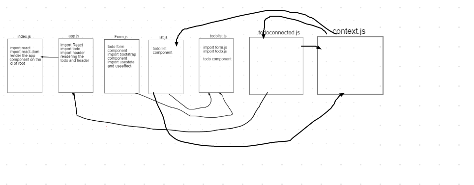

## Project: lab-32

### Author: Alaa almasri

### Links and Resources

- [submission PR](https://github.com/alaaalmasri12/todo/pull/2)
- [github deployment](https://alaaalmasri12.github.io/todo/)

### Setup

#### `.env` requirements (where applicable)

i.e.

#### How to initialize/run your application (where applicable)

- e.g. `npm run start`

#### UML

